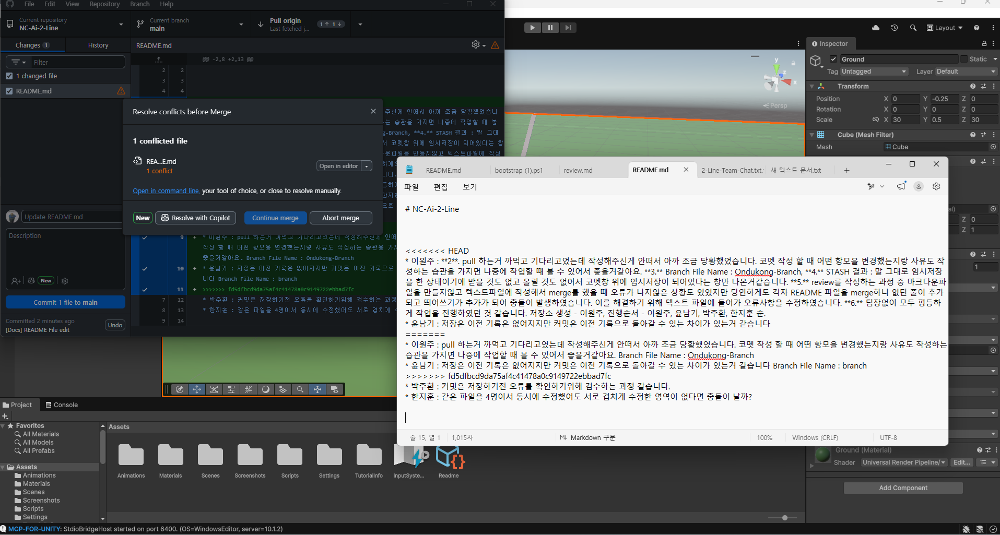
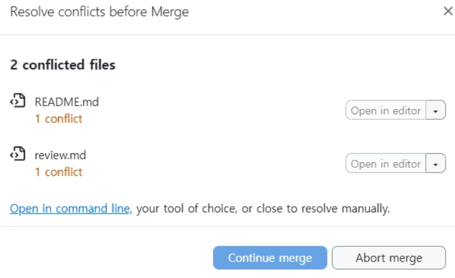

# NC-Ai-2-Line

* #### 이원주 :

**2**. pull 하는거 까먹고 기다리고었는데 작성해주신게 안떠서 아까 조금 당황했었습니다. 코멧 작성 할 때 어떤 항모을 변경했는지랑 사유도 작성하는 습관을 가지면 나중에 작업할 때 볼 수 있어서 좋을거같아요.

**3.** Branch File Name : Ondukong-Branch,

**4.** STASH 결과 : 말 그대로 임시저장을 한 상태이기에 받을 것도 없고 올릴 것도 없어서 코멧창 위에 임시저장이 되어있다는 창만 나온거같습니다.

**5.** review를 작성하는 과정 중 마크다운파일을 만들지않고 텍스트파일에 작성해서 merge를 했을 때 오류가 나지않은 상황도 있었지만 당연하게도 각자 README 파일을 merge하니 없던 줄이 추가되고 띄어쓰기가 추가가 되어 충돌이 발생하였습니다. 이를 해결하기 위해 텍스트 파일에 들어가 오류사항을 수정하였습니다.

**6.** 팀장없이 모두 평등하게 작업을 진행하였던 것 같습니다. 저장소 생성 - 이원주, 진행순서 - 이원주, 윤남기, 박주환, 한지훈 순.

* #### 윤남기 :

**2.** 저장은 이전 기록은 없어지지만 커밋은 이전 기록으로 돌아갈 수 있는 차이가 있는거 같습니다

**3.** Branch File Name : branch

4\. STASH 결과 : 임시저장 상태로 창이 뜨고 ㅡ브랜치에서 수정활동 후 다시 메인으로 돌아와 임시저장 작업을 다시 복원하는 별 이벤트 없는 작업이었던거 같습니다

5\. 텍스트 파일 이름을 처음부터 .md로 하고 작업하고 저장하니 그대로 텍스트 파일로 남아 충돌이 난거 같습니다.

6\. 모두다 적극적으로 활동해주셨습니다 많이 배운거 같습니다 shash 해보기 - 윤남기, 진행순서 - 이원주, 윤남기, 박주환, 한지훈 순

* #### 박주환 :

**2.** 커밋은 저장하기전 오류를 확인하기위해 검수하는 과정 같습니다.

**3.** Branch File Name : Branch\_JH

4\. STASH 결과 : stash 후 화면이 view stash 버튼이 생겼습니다. restore 했을때 원래대로 돌아왔습니다.

5\. 브랜치에서 작업하고 메인으로 돌아갔을 때 작업들이 다 초기화 됐었는데 커밋을 안하고 돌아가서 다 사라졌던 것이었습니다.

6\. 예시 : README Text Edit, docs : 리드미에 브랜치 이름 추가

* #### 한지훈 :

**2.** 같은 파일을 4명이서 동시에 수정했어도 서로 겹치게 수정한 영역이 없다면 충돌이 날까?

3. 브랜치 이름 : review_Jihoon

4. stash 작업이 실제로 자주 일어나는 지는 잘 모르겠지만, 잠시 수정 사항을 옆에 놔뒀다가 다른 작업을 하거나 팀원을 도와줄 때 유용하게 쓰일 수 있을 것 같습니다.

5. README 파일 확장자가 .md 또는 .txt 등 다양해서 머지할 때 원하는대로 충돌이 일어나지 않았고, 파일이 하나 더 추가되는 삽을 펐습니다. 또 브랜치 병합 순서도 꽤 중요하다고 느꼈습니다.

6. 팀원 모두가 적극적으로 충돌을 해결하려고 하고, 단순히 해결에서 그치지 않고 왜 이러한 충돌이 났는 지 등을 논리적으로 생각해보려고 해서 모두 좋았습니다. 저장소 생성 - 이원주, 진행순서 - 이원주, 윤남기, 박주환, 한지훈

